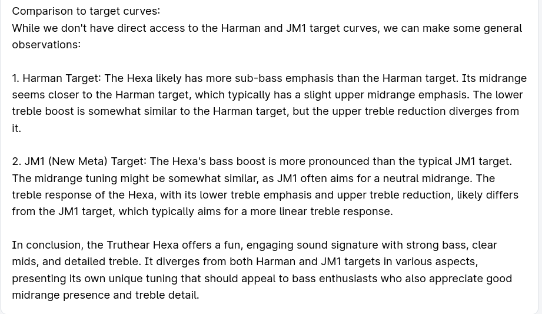

# PromptQL Audio Assistant

Hasura DDN Project available at: https://console.hasura.io/project/organic-liger-4989

This Hasura DDN supergraph enables you to query in-ear monitors (IEMs) and their frequency responses. The AI assistant helps you explore the sound signature of a specific IEM and compare it with other IEMs or target responses.

### Available Target Responses
- **JM1** (new meta)
- **Harman**
- **Crinacle** (IEF 2023)

## Use Cases

### Sound signature of an IEM

- The assistang would explain the sound signature and tonality of an IEM.

<p align="center">
  
  
</p>

- Also provides comparisons with target (preference) curves

<p align="center">
  
</p>

- Compare IEMs

<p align="center">
  
  
</p>

- Get Eq recommendation

<p align="center">
  
  
</p>

### Get IEM recommendations

<p align="center">
  
  
  
</p>


## Getting started

### Load measurements on your Postgres database.

Create the required tables:
```sql
-- Create the `iems` table to store information about each IEM
CREATE TABLE iems (
    iem_id SERIAL PRIMARY KEY,
    iem_name VARCHAR(255) UNIQUE NOT NULL
);

-- Create the `frequency_responses` table to store frequency and amplitude data for each IEM
CREATE TABLE frequency_responses (
    response_id SERIAL PRIMARY KEY,
    iem_id INT REFERENCES iems(iem_id) ON DELETE CASCADE,
    frequency_hz REAL NOT NULL,
    amplitude REAL NOT NULL
);

-- Create an index on the `frequency_hz` column for efficient querying
CREATE INDEX idx_frequency_responses_frequency ON frequency_responses (frequency_hz);
CREATE INDEX idx_frequency_responses_iem_id_frequency ON frequency_responses (iem_id, frequency_hz);
```

Load the measurement data in your database.
```bash
cd measurements
pip install -r requirements.txt

PG_URL= <your-postrgres-url-string> python load_db.py
```

### Set up Hasura DDN project

- [Create a Hasura account](https://promptql.hasura.io/docs/getting-started#create-a-hasura-account) if you don't have on already.
- [Install](https://promptql.hasura.io/docs/getting-started#install-the-ddn-cli) Hasura DDN CLI.
- [Login with CLI](https://promptql.hasura.io/docs/getting-started#log-in-with-the-cli)
- Set up `.env` file by `cp .env_example .env`
- Add Anthropic API key to `.env`. Get an api key from https://console.anthropic.com/settings/keys

```
# .env
...
ANTHROPIC_API_KEY=<your-anthropic-api-key>

```
To use an OpenAI key instead, you’ll have to set `OPENAI_API_KEY` in your `.env` file and change the environment variable
`LLM` to openai in the compose.yaml file.

- Add your Postgres database url (must be accessible outside localhost) to the `APP_PG_CONNECTOR_CONNECTION_URI` in `.env`
- Setup your DDN project `ddn project init`
- [Fire up your PromptQL](https://promptql.hasura.io/docs/getting-started#fire-up-your-promptql-project) project by
  - `ddn supergraph build local`
  - `ddn run docker-start`
- [Open the PromptQL](https://promptql.hasura.io/docs/getting-started#fire-up-your-promptql-project) playground by `ddn console --local`

Now you’re ready to query the sound signature of your chosen IEM and compare it with others or with target responses.
